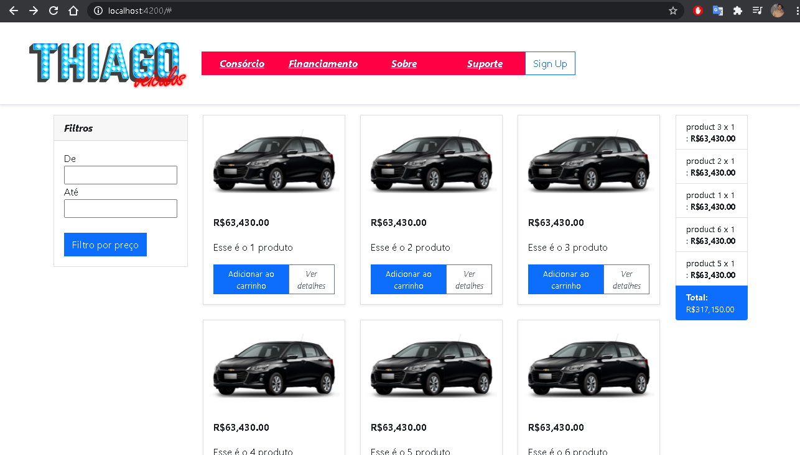
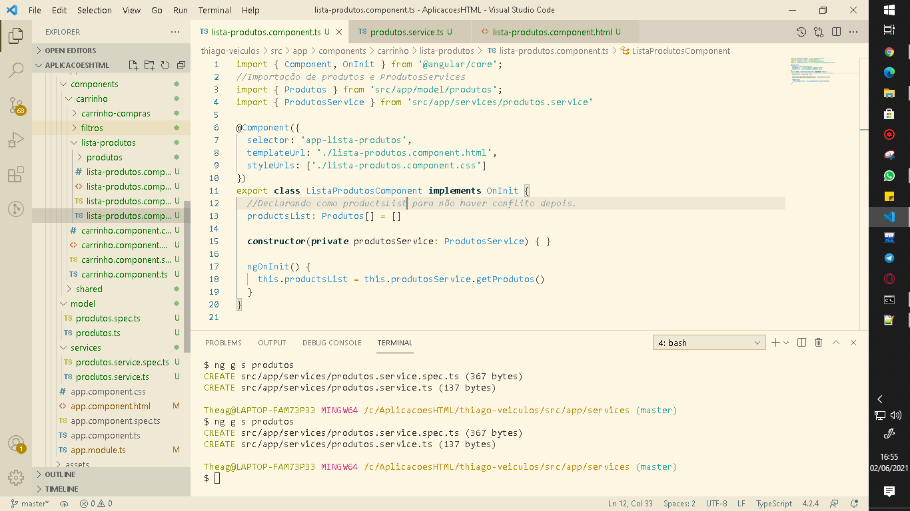
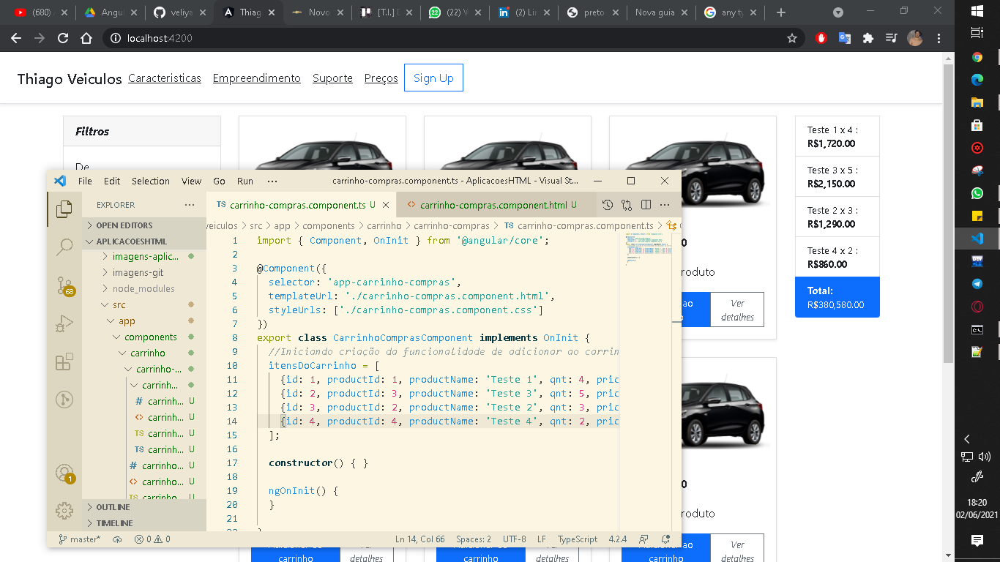
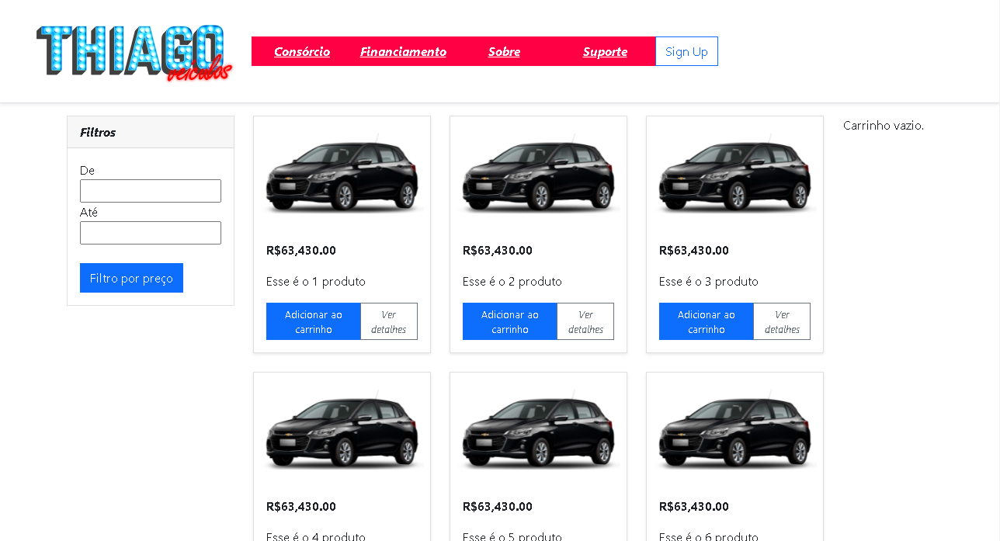

 </img> 
  
  

 2021, Thiago Hercules. All rights reserved. 
  
  
📍 Link to application deployed in vercel:  
    ↳ https://thiago-veiculos.vercel.app/   
  
<h3><b> <em>⚠️ Aviso importante! ⚠️</em> </b> </h3>

 • O projeto não encontra-se com formato responsivo aplicado por falta de tempo, então sugiro visualização por desktop. 
 

 • Sem integração com API para chamada das informações dos produtos em questão (carros). 
 

 • Back-end desenvolvido localmente com TypeScript. 
 

 • Por falta de tempo por conta do trabalho, consegui desenvolver apenas o back-end da função de adicionar carrinho. 
 

 • Back-end da função filtro não criado, pois precisaria de integração com API, porém ideia aplicada ao mock-up do website. 
  

<h3><b> <em>🚩 Qual foi o desafio proposto? 🚩</em> </b> </h3>

 • Criar projeto backend utilizando (Node.Js) <b> (Opcional) </b> 
 

 • Criar crud de veículos com os seguintes atributos (id, placa, chassi, renavam, modelo, marca, ano). Obs.: Os dados podem ser salvos em arquivos <b> (Opcional) </b> 
 

 • Criar teste unitários utilizando Mocha (Node) para cada uma das operações (create, read, update, delete) <b> (Opcional) </b> </b> 
 

 • Criar recursos rest para acesso aos dados dos veículos <b> (Opcional) </b> 

 • Criar projeto front-end utilizando a tecnologia Angular 5 + <b> (Obrigatório) 🚩 </b> 

 • Criar lista de veículos <b> (Obrigatório) 🚩 </b> 

 • Disponibilizar projeto no github <b> (Obrigatório) 🚩 </b> 
  

<h3><b> <em> 🗃️ Resumo sobre o projeto: </em> </b> </h3>

 Após muito tempo sem usar angular, me aventurei a programar em TypeScript para desenvolver o pequeno back-end do projeto, que além do site mockado, acredito que seria um diferencial para a breve entrevista. 
 
 

 Este projeto foi desenvolvido com o intuito de participar da vaga de desenvolvedor pleno em front-end de uma empresa em específico, onde os mesmos nos desafiaram a criar uma lista de carros, como visto nos tópicos acima. Senti que para me desafiar a fazer diferente, criei uma mini loja de carros chamada de Thiago Veículos.
    

<em><b> Print de funcionalidade da página: ⤵️⤵️⤵️⤵️⤵️⤵️ </b></em>
 
 </img>  

<em><b> Prints programando e desenvolvendo o projeto: </b></em>

  ↳ Sim, tem dias que gosto de usar temas claros e em outros, escuros kkkkkkk. 
  
 </img> 
 </img>  

<em><b> Prints adicionando back-end do adicionar ao carrinho: </b></em>

  ↳ print 1: sem nada no carrinho e mensagem aparecendo indicando a falta de produtos 

  ↳ print 2: funcional após clicar em vários produtos e cálculo final. 
  
 </img> 
 </img>  

<h3><b> <em>📦 About project: 📦</em> </b> </h3>

<em><b>Frameworks:</b></em> 

<em><b>Languages:</b></em> 

 

<em><b>I.D.E:</b></em> 

 

<h1><b>Hello, my name is Thiago Hercules 👋</b><i class="fas fa-code"></i></h1>

<em>Jr. fullstack developer. | Freelancer UX/UI Designer. </em>

<h3><em><b>🌍About me:🧠</b></em></h3> 

 ♻️ A java enthusiast.  
	🎓 Computer science student.   
	📚 Dev. Manager at Jupiter Consultory  
	🍻 A beer on the weekend doesn't hurt.   
	🔥 Freelancer UX/UI Designer.
	

 
 

 
 

 

 ↳ The icarus project is a personal achievement. Since I was little I always wanted to write great comic books, just like the ones we see in the drawings, so, I present to you the icarus project, with deploying the html on a hosting site. 

<h2><em><b> 🔹 Languages/Frameworks of i know: 🎓</b></em></h2> 
 

 

 

 
 

 

 • Projects in format: <b> MVC, DAO and CRUD.<b>
 

 • Progressive web apps model.<b>
 

 • Agile methodologies with Scrum.<b>

<h2><em><b> 🔹 Languages of i need to improve myself: 📚</b></em></h2>

<h2><em><b> 🔹 I am interested in: 🧐</em><b></h2> 

	
<h2><em><b> 🔹 About BootCamps: 🚀</em><b></h2> 

 ↳ Bootcamp developer mobile | IGTI ✅ 
 

 ↳ Bootcamp anywhere code | Digital Innovation One ✅ 
  

 
 
# Documentação de projeto do Angular.

This project was generated with [Angular CLI](https://github.com/angular/angular-cli) version 9.0.2.

## Development server

Run `ng serve` for a dev server. Navigate to `http://localhost:4200/`. The app will automatically reload if you change any of the source files.

## Code scaffolding

Run `ng generate component component-name` to generate a new component. You can also use `ng generate directive|pipe|service|class|guard|interface|enum|module`.

## Build

Run `ng build` to build the project. The build artifacts will be stored in the `dist/` directory. Use the `--prod` flag for a production build.

## Running unit tests

Run `ng test` to execute the unit tests via [Karma](https://karma-runner.github.io).

## Running end-to-end tests

Run `ng e2e` to execute the end-to-end tests via [Protractor](http://www.protractortest.org/).

## Further help

To get more help on the Angular CLI use `ng help` or go check out the [Angular CLI README](https://github.com/angular/angular-cli/blob/master/README.md).
